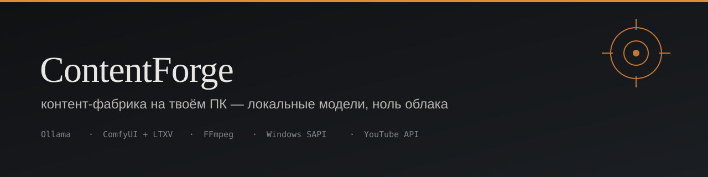

# ContentForge 🛠️ — контент-фабрика для Windows

<p align="center">
  
</p>

<p align="center">
  <a href="https://github.com/yevhenypupotapov-code/contentforge/releases"></a>
  <a href="LICENSE"></a>
  
  
</p>

Приложение контент-фабрики: ставится на ПК, проверяет систему и запускает выпуск —
от темы до публикации на YouTube. Плюс веб-панель для наблюдения за заводом.

**Никакого облака в создании контента.** Сценарий считает локальная модель, кадры — ComfyUI,
голос — системный синтез Windows, монтаж — FFmpeg.

---

## Скачать

<p align="center">
  <a href="https://github.com/yevhenypupotapov-code/contentforge/releases/latest">
    
  </a>
</p>

Распаковать → `ContentForge.bat` → «Проверить этот ПК».

## Что в приложении

```
ContentForge.bat            меню: проверка ПК, установка пакетов, запуск заводов
tools/preflight.ps1         проверка Python, Ollama, ComfyUI, FFmpeg, GPU, RAM, дисков
tools/install.ps1           установка и обновление Python-пакетов
tools/run-factory.ps1       запуск одной проходки завода (Shorts или длинный)
config.example.json         образец настроек
SECURITY.md                 что никогда не публикуется (ключи, токены, личные пути)
```

## Веб-панель

В репозитории есть панель управления (React + Vite + Node): обзор, конвейер, выпуски,
расписание, каналы, аналитика, настройки.

```bash
npm install
npm run dev
```

## Требования

| Компонент | Зачем |
|---|---|
| Windows 10/11 | — |
| Python 3.10+ | запуск завода |
| FFmpeg | монтаж и кодирование |
| [Ollama](https://ollama.com) | локальная языковая модель для сценария |
| ComfyUI + LTXV | генерация кадров и видео |
| NVIDIA GPU 8 ГБ+ | ускорение генерации |

## Режим работы

Выпуски публикуются **в открытом доступе**, только **по пятницам и субботам**:
длинный завод — 11:00 и 18:00, короткий — 07:00, 15:00, 23:00.

## Ссылки

- Приложение: [`app/`](app/)
- Ядро длинного завода: [ltx-youtube-gold-standard](https://github.com/yevhenypupotapov-code/ltx-youtube-gold-standard)
- Канал: [YEVHEN POTAPOV](https://www.youtube.com/@yevhenpotapov5956)
- GitHub: [yevhenypupotapov-code](https://github.com/yevhenypupotapov-code)

<p align="center"><sub>Локальные модели · Windows · 2026</sub></p>
